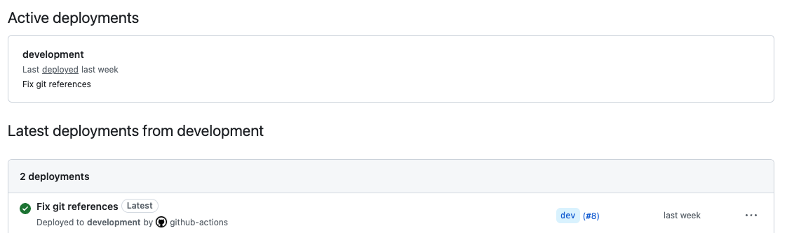

# Deploy Commands

Simplify your application deployments with a command set designed for pm2 process-managed Node.js Frameworks (Vue, React), Laravel, WordPress, and other html or PHP projects.

Automate these deployments seamlessly using GitHub Actions (connection to deploy servers via ssh or aws-ssm) to optimize your development workflow for efficiency and ease.

#### Preview: Directory Structure uses Releases Folder
```
- yoursite.com
-- deploy-commands
-- commands           # symlink to deploy-commands/{type}-deploy
-- releases
---- 1.0.0            # release on tag
---- 1.0.1            # release on tag
---- dev              # release on branch
```

#### Preview: Basic Commands in Action

```bash
cd /var/www/yoursite.com/commands

./app-release -v=1.0.1 -t=true -b=false -r=<repo-url>
./app-deploy -v=1.0.1 -s=my-app-server
```

#### Preview: GitHub Action calls `deploy.sh` script to run the above sequence according to git event (eg. tag release `published` vs branch `push`)

```bash
cd ~/

deploy.sh --repo user/project --branch dev
# or
deploy.sh --repo user/project --tag 1.0.1
```

#### How does it work & how can it be customized?

👉 [Get started](#installation), jump to [contents](#contents), or enjoy this quick overview:

- The `app-release` and `app-deploy` scripts look for sibling custom config files (eg. apprepo, appservername, applogsfolder, env files, etc) to minimize the need for lots of switches and to run the processes.
- Running custom build, test, reload processes is possible by writing your own scripts: `npm-command.sh` to be called during `app-release`,`test-command.sh` and subsequent `reload-command.sh` to enact if successful test-command in `app-deploy`. Working examples are provided!
- For simplistic approach, you can use `app-release` interactively and manually execute builds and releases while in your server.
- Optionally, for automatic deployments via GitHub Actions - Copy from an (SSH, or AWS-SSM) appropriate workflow template from deploy-commands to your project `.github/workflows/deploy.yml` and setup secrets and variables in github repo settings
- `deploy.sh` uses [`deploy.config.json`](#step-2-create-a-deploy-script-on-server) to determine which `/var/www/site.com/commands` to use for the deployment.

---

## Contents

- [Installation](#installation)
- [Usage](#usage) - [Building](#building-a-release---prompted-vs-unprompted) | [Deploying](#deploy-any-release---unprompted-only)
- [Setup Config Files](#setup-config-files) - [General](#generic-deploy-commands-config) | [PM2](#pm2-deploy-commands-config) | [Laravel](#laravel-deploy-commands-config) | [Wordpress/PHP](#wordpress-deploy-commands-config)
- [Automated Deployments via GitHub Actions](#automated-deployments-via-github-actions)

  → [Step 1: Copy Workflows & Setup in GitHub](#step-1-copy-workflows-and-setup-in-github)

    - [Option A: SSH Workflow](#option-a) | [Option B: AWS SSM Workflows](#option-b)

  → [Step 2: Create a Deploy Script on Server](#step-2-create-a-deploy-script-on-server)

---

## Installation

> 💡 If you want to test this deployment process locally, you can use [amurrell/SimpleDocker](https://github.com/amurrell/SimpleDocker) (a blank docker ubuntu container) to setup your site and deploy-commands repo.


To get started, follow these steps:

1. On your server, navigate to `/var/www/<yoursite.com>`. If `<yoursite.com>` is your project's repo, you need to move it to `/var/www/<yoursite.com>/releases/<git-project>`.

1. Clone this repository:

    ```bash
    cd /var/www/yoursite.com
    git clone git@github.com:amurrell/deploy-commands.git
    ```

1. Create a symbolic link to the appropriate command folder based on your application type:

    ```bash
    ln -s deploy-commands/{TYPE}-deploy ./commands
    ```

    Replace `{TYPE}` with one of the following: `pm2` (for Node.js projects), `laravel`, or `wordpress`.

    For example:

    ```bash
    ln -s deploy-commands/pm2-deploy ./commands
    ```

4. Configure your deployment by adding configuration files. See the [Setup Config Files](#setup-config-files) section for details on configuring your deployment.

5. Utilize GitHub Actions via Workflows to automate deployments. See the [Automated Deployments via GitHub Actions](#automated-deployments-via-github-actions) section for details on configuring your deployment.

[↑ Top](#contents)

---

## Usage

This deployment system revolves around two main actions: "releasing" and "deploying."

Quick Example:
```bash
cd /var/www/yoursite.com/commands

./app-release -v=1.0.1 -t=true -b=false -a=true
./app-deploy -v=1.0.1 -s=my-app-server
```

**Releasing:** This action involves cloning the desired repository into a "releases" folder and checking out a specified branch or tag. After the checkout, it manages build tasks, such as running `npm install && npm run build` or `composer install` depending on your application.

Read more in the [Building a release](#building-a-release) section.

**Deploying:** This action replaces the current live directory with a symbolic link called "current," pointing to the selected release. It can also run a custom test command, and upon success, a reload command for associated services if needed (e.g., `sudo nginx -t` and `sudo service nginx reload`, respectively).

Read more in the [Deploy a release](#deploy-a-release) section.

You can initiate a release in two ways: prompted or unprompted. For automation purposes, you need to use the unprompted method. Similarly, deployment commands are always unprompted.

[↑ Top](#contents)

---

### Building a Release

You can initiate `app-release` in two different ways:

1. **Prompted** By simply running the command without parameters, the system will ask you a series of questions to guide the release process.

    ```
    ./app-release
    ```

2. **Unprompted** You can also run the command with parameters to avoid the prompts. This is useful for automation.

    ```
    ./app-release -r=git@github.com:you/yourrepo.git -v=1.0.1 -t=true -b=false -a=true
    ```

    | Switch | Description |
    |----|----|
    | -r | Repository URL to clone. This can be omitted if apprepo config file exists. |
    | -v | Specifies the version to checkout. This can be a text label or a tag number. |
    | -t | Indicates if you're using a tag. Accepts `true` or `false`. |
    | -b | If you want to specify a branch to checkout, provide its name; else, use false.  |
    | -a | Exclusive to `laravel-deploy`. Determines if the assets directory should be built during release using `./build-assets`. |

#### Deploy a Release

For deployment, you'll need to specify a release folder. This is handy for pushing new versions as well as reverting to prior ones. Deployment commands are always unprompted:

```
./app-deploy -v=1.0.1 -s=my-app-server
```

| Switch | Description |
|----|----|
| -v | Version to deploy; required - can be text or a tag number |
| -s | The server name (required for PM2). If `appservername` config file is present, this can be omitted.|

**Note:** During the deployment, the system will run the `test_command`. If tests pass, the `reload_command` will be executed, provided these commands are present in your commands directory.

[↑ Top](#contents)

---

## Setup Config Files

To help automate deployment processes, you can use these configuration files to avoid some repetitive prompts, eg. the app's repo to build from, or the pm2 server name.

These are ignored by git and live inside the commands folder you created above.

Place your config files into the commands folder directly, like this:

#### .../commands
```
- app-deploy
- app-release
- [other possible commands]
- apprepo # a config file
```

### Generic Deploy-Commands Config

| File | Example Contents | Description |
|----|----|-----|
| apprepo | `git@github.com:you/yourrepo.git` | Optional - used to avoid being prompted every time |
| owner_user | `www-data`, `ubuntu` | Optional - default is `www-data` and is used with chown command on project files and the symbolic link live `current` folder<br>eg.<br>`sudo chown -R $OWNER_USER:$OWNER_GROUP "<folder>"`<br> or derived, <br>`sudo chown -R ubuntu:www-data /var/www/project/current` |
| owner_group | `www-data`, `ubuntu` | Optional - default is `www-data` and is used with chown command on project files and the symbolic link live `current` folder<br>eg.<br>`sudo chown -R $OWNER_USER:$OWNER_GROUP "<folder>"`<br> or derived, <br>`sudo chown -R ubuntu:www-data /var/www/project/current` |
| test_command | `./test_command.sh` | Optional - The presence of this file will ensure it happens and only with successful exit will it run reload_command.<br>Purposely, it calls another command so that the exit status and "work" can be based on the script it calls. Useful for testing configuration eg. nginx -t |
| test_command.sh | `sudo nginx -t`, <br>`sudo php$PHP_VERSION-fpm -t` | Optional - copy from example for ideas. |
| reload_command | `./reload_command.sh` | Optional - only ran if test_command was successful. Useful for reloading nginx |
| reload_command.sh | `sudo service nginx reload`, <br> `sudo service nginx reload && sudo service php-fpm$PHP_VERSION restart` | Optional - copy from example for ideas. |
| npm_command | `./npm_command.sh`,<br>`nvm use && npm install && npm run production` | Optional - default is `npm install && npm run build`. |
| npm_command.sh | `npm install && npm run build`,<br>`nvm use && npm install && npm run production` | Optional - copy from example for ideas. |

[↑ Top](#contents)

---

### PM2 Deploy-Commands Config

| File | Example Contents | Description |
|----|----|-----|
| appfolder | `app` | Optional - Your package.json and .env file should be here, relative to repo root. Only needed if your app is in a subfolder of your repo eg. `yourrepo/app` |
| appservername | `my-app-server` | Optional - the name of the server used in pm2, only needed to avoid being prompted everytime |
| appenvfile | `BASE_API_URL=https://someurl` | Optional - If you need to use a dotenv file with deploys on this server |
| npm_command | `npm install && npm run build`, `npm run production` | Optional - default is `npm install && npm run build`. |
| applogsfolder | `logs`, `DockerLocal/logs` | Optional - makes a directory `logs` by default, but nothing else happens - useful to create this directory for pointing php/nginx log files to

The **appservername** should correlate to your ecosystem file, if you are using one with pm2.

#### Ecosystem

Create a file `ecosystem.config.js` similar to below and place it in the same level as your `commands` folder

```
module.exports = {
  apps : [{
    name: 'NAME OF YOUR SERVER',
    cwd: './current/app',
    script: './node_modules/nuxt-start/bin/nuxt-start.js',
    exec_mode: 'cluster',
    instances: '2',
    autorestart: true,
    log_date_format: "MM/DD/YYYY HH:mm:ss",
    args: "start"
  }],
};
```

Where your directory structure might look like:
```
- yoursite.com
----- deploy-commands
----- commands      # symbolic link to deploy-commands/pm2-deploy
----- releases
  ----- 1.0.0         # release on tag
  ----- 1.0.1         # release on tag
  ----- dev           # release on branch
----- ecosystem.config.js
```

Ensure that the "NAME OF YOUR SERVER" matches the appservername config or the `-s` switch in the release/deploy/pm2-deploy/commands

From that folder, run your `pm2 start`

[↑ Top](#contents)

---

### Laravel Deploy-Commands Config

| File | Example Contents | Description |
|----|----|-----|
| laravelfolder | `laravel-app` | Optional - only needed if laravel is in a subfolder of your repo eg. `yourrepo/laravel-app` |
| assetsfolder | `laravel-app/resources/vue` | Optional - if you have frontend assets to build - this is the directory location of your package.json in your repo. eg `yourrepo/laravel-app/resources/vue` or `yourrepo/resources/vue`. The presence of this path will auto build assets folder unless passing -a=false to app-release. |
| assetsenvfile | {.env file} | Optional - will get copied into your assetsfolder (relative to package.json) |
| laravelenvfile | {typical laravel .env file} | Optional - will get copied into your release |
| laravellogsfolder | `logs`, `DockerLocal/logs` | Optional - makes a directory `logs` by default, but nothing else happens - useful to create this directory for pointing php/nginx log files to

Laravel deployments uses **a releases folder** such that the directory structure looks like this:

```
- yoursite.com
----- deploy-commands
----- commands              # symbolic link to deploy-commands/laravel-deploy
----- ecosystem.config.js   # optional, eg. if using for horizon
----- releases
---------- 1.0.0            # release on tag
---------- 1.0.1            # release on tag
---------- dev              # release on branch
```

#### Ecosystem file for horizon in laravel

You might also have an ecosystem.config.js file here for pm2 to run horizon

```
{
  name: 'laravel-horizon',
  cwd: './current/app',
  interpreter: 'php',
  script_path: '/var/www/current/app/artisan',
  script: 'artisan',
  args: 'horizon',
  instances: 1,
  autorestart: true,
  watch: false,
  max_memory_restart: '1G',
  merge_logs: true,
  out_file: "/var/www/yoursite.com/current/DockerLocal/logs/horizon.log",
  error_file: "/var/www/yoursite.com/current/DockerLocal/logs/horizon.log",
  log_date_format: "MM/DD/YYYY HH:mm:ss",
}
```

[↑ Top](#contents)

---

### Wordpress Deploy-Commands Config

You could use this for any php project, but a common use case is wordpress.
If the uploads folder is present in the below directory structure, each release's wordpress uploads path will symlink to it.

| File | Example Contents | Description |
|----|----|-----|
| assetsfolder | `html/wp-content/themes/<yourtheme>/` | Optional - if you have frontend assets to build - this is the directory location of your package.json in your repo. |
| logsfolder | `logs`, `DockerLocal/logs` | Optional - makes a directory `logs` by default, but nothing else happens - useful to create this directory for pointing php/nginx log files to

Wordpress deployments uses **a releases folder** such that the directory structure looks like this:

```
- yoursite.com
----- deploy-commands
----- commands           # symbolic link to deploy-commands/wordpress-deploy
----- uploads            # uploads folder in releases will symlink to this
----- releases
---------- 1.0.0         # release on tag
---------- 1.0.1         # release on tag
---------- dev           # release on branch
```

[↑ Top](#contents)

---

## Automated Deployments via GitHub Actions

Follow these steps to set up a deployment process via github workflows for your project:

- [Step 1: Copy Workflows & Setup in GitHub (or AWS)](#step-1-copy-workflows-and-setup-in-github)
  - [OPTION A: SSH Workflow](#option-a)
  - [OPTION B: AWS SSM Workflow](#option-b)

- [Step 2: Create a Deploy Script on Server](#step-2-create-a-deploy-script-on-server)

- [Step 3 (Optional): Setup GitHub Environments for GitHub Deployments](#step-3-optional-setup-github-environments-for-github-deployments)

Workflows depend on a `deploy.sh` script and `deploy.config.json` file that will being using the `app-release` and `app-deploy` scripts. Be sure to follow that pattern for it to work.

This is the `deploy-commands` file structure convention:

- `/var/www/<domain>/deploy-commands`
- `/var/www/<domain>/releases`
- `/var/www/<domain>/current` (this should be a symlink pointing to a specific version in the releases directory)

[↑ Top](#contents)

---

### Step 1: Copy Workflows and Setup in GitHub

#### OPTION A)

**SSH Workflow: Integrate Workflow File & Setup Key Pairs**

With this option, you will be using `ssh` (port 22) to connect to your server. It's very easy, but it may not be the most secure. If you are using aws and ssm, you may want to use the next option instead.

Copy the `deploy-workflow.yml` into your site's repository under the `.github/workflows/` directory:

```bash
cp deploy-workflow.yml /path/to/your/site/repo/.github/workflows/deploy.yml
```

Edit the branches you want to trigger the workflow on. By default, it is set to `main`, `dev` and release publishes.

- Save the following secrets to your repository:
  - `SERVER_ADDRESS` (ip or domain name)
  - `SERVER_SSH_KEY` (private key & passwordless)
  - `DEPLOY_USER`    (eg. ubuntu)
  - `SERVER_KEYSCAN` (get from local, trusted machine that has connected before - eg. run `ssh-keyscan your.server.ip` and paste into secret)
- To generate a private & passwordless ssh key pair, you can use the following command:

  ```bash
  ssh-keygen -t ed25519 -f ~/.ssh/server-deploy_key -q -N ""
  ```

  - `-t` specifies the type of key to generate (ed25519 is more secure than RSA)
  - `-f` specifies the filename for the generated key pair
  - `-q` generates the key pair quietly
  - `-N` specifies a passphrase to use for the key pair (an empty passphrase means no password is required)

- Remember to store the public key pair (matching private key `SERVER_SSH_KEY`) in the `authorized_keys` file of the deployment user. eg. /home/ubuntu/.ssh/authorized_keys

- If you use this repo on different servers - eg. dev server vs prod server, you may want to setup a different workflow file for each and prefix your secrets/vars with `DEV_` or `PROD_` respectively (or utilize github environment configurations).

- Be sure to review the events that will trigger the workflow. For example, you may want to update the `deploy-workflow.yml` version to work _either_ `main` branch push OR tag `release` publish as it would be redudant to have both trigger the deployment.

[↑ Steps](#automated-deployments-via-github-actions) |
[↑ Top](#contents)

---

#### OPTION B)

**AWS SSM Workflows: Integrate workflows & Setup IAM, GitHub Secrets and GitHub Variables**

You may not have SSH ports open for security reasons and may be using AWS with SSM - in which case, you can use the `deploy-workflow-aws-ssm-<env:prod|dev>.yml` workflow files instead. Copy them into your site's repository under the `.github/workflows/` directory.

> [!IMPORTANT]
> Be sure to review the events that will trigger the workflow. For example, you may want to update the `deploy-workflow-aws-ssm-prod.yml` version to work _either_ `main` branch push OR tag `release` publish as it would be redudant to have both trigger the deployment.

AWS will requite some steps too:

1. create an IAM user
2. get its access key and secret key
3. attach an inline policy like the following (replace `<ACCOUNT_ID>` and `<INSTANCE_ID>` with your own):

  ```json
  {
    "Version": "2012-10-17",
    "Statement": [
      {
        "Sid": "VisualEditor0",
        "Effect": "Allow",
        "Action": [
          "ec2:DescribeInstances",
          "ssm:GetConnectionStatus",
          "ssm:DescribeInstanceProperties",
          "ssm:GetCommandInvocation",
          "ssm:ListCommands",
          "ssm:ListCommandInvocations"
        ],
        "Resource": "*"
      },
      {
        "Sid": "VisualEditor1",
        "Effect": "Allow",
        "Action": [
          "ssm:SendCommand"
        ],
        "Resource": [
          "arn:aws:ec2:*:<ACCOUNT_ID>:instance/<INSTANCE_ID>",
          "arn:aws:ssm:*::document/*"
        ]
      }
    ]
  }
  ```

You will need to ensure that your site's repository is setup with both **secret** and **variable** configurations setup in github that are mentioned in these workflow files as:

- `${{ secrets.<secret-name> }}`
- `${{ vars.<variable-name> }}`

It is recommended that you build and test these workflows on your local machine - which thankfully 🙏 you can via [act](https://github.com/nektos/act) with docker.

Keep in mind that these will attempt to trigger remote deploys, so ideally test the workflows on non-production servers eg. dev workflow.

```bash
cd <your-repo>
act
  --secret-file github-secrets \
  --var-file github-vars \
  -e event.json \
  -W '.github/workflows/deploy-dev.yml'
```

Place these files into your repo (and probably them add to gitignore):

**github-secrets**

```bash
DEV_AWS_ACCESS_KEY_ID=xxx
DEV_AWS_SECRET_ACCESS_KEY=xxx
PROD_AWS_ACCESS_KEY_ID=xxx
PROD_AWS_SECRET_ACCESS_KEY=xxx
```

**github-vars**

```bash
DEV_AWS_REGION=us-east-2 # for example
DEV_INSTANCE_USER="ubuntu" # for example
DEV_INSTANCE_ID="i-xxx"
PROD_AWS_REGION=us-east-2 # for example
PROD_INSTANCE_USER="ubuntu" # for example
PROD_INSTANCE_ID="i-xxx"
```

**event-json**

```json
{
    "ref": "refs/heads/dev"
}
```

These **github-secrets** and **github-vars** correlate to the same secrets and variables you will need to setup in the github repository settings.

[↑ Steps](#automated-deployments-via-github-actions) |
[↑ Top](#contents)

---

### Step 2: Create a Deploy Script on Server

We need `deploy.sh` and `deploy.config.json` on your server.

**deploy.sh** is in this repo - get it on your server

```bash
### ssh connection from local machine
scp deploy.sh <deploy-user>@<your-server-ip>:~/

## from inside your server (eg. via interative ssm)
curl -0 https://raw.githubusercontent.com/amurrell/deploy-commands/main/deploy.sh
chmod +x deploy.sh
```

**deploy.config.json**

Create it manually and put on the server at deploy user's home directory:

```json
{
  "<user>/<repo-name>": {
    "<env>": {
      "commands": "/var/www/<domain>/commands",
      "releases": "/var/www/<domain>/releases"
    }
  }
}
```

Or, to generate this file, use the `generate-deploy-config.sh` provisioning script template from [SimpleDocker](https://github.com/amurrell/SimpleDocker), another awesome amurrell repo:

```bash
### ssh connection from local machine
curl -o generate-deploy-config.sh https://raw.githubusercontent.com/amurrell/SimpleDocker/dev/scripts/templates/090-deploy-config-RAOU.sh
scp generate-deploy-config.sh <deploy-user>@<your-server-ip>:~/
chmod +x generate-deploy-config.sh
./generate-deploy-config.sh

### from inside your server (eg. via interative ssm)
cd ~
curl -o generate-deploy-config.sh https://raw.githubusercontent.com/amurrell/SimpleDocker/dev/scripts/templates/090-deploy-config-RAOU.sh
chmod +x generate-deploy-config.sh
./generate-deploy-config.sh
```

This script will inspect the `/var/www/` directory on your server, identify domain folders that contain `deploy-commands` repo, and generate the `deploy.config.json` file accordingly.

#### Notes on the `deploy.config.json` file:

`<env>` can have values like `prod` which maps to domain structures like `www.site.com` or `site.com`. Any subdomain, like dev.site.com, would have an `<env>` value of `dev`.

If your server has only 1 env setting, it will not do any branch/tag related checks to decide which `/var/www/<folder>` to deploy to. This is useful if you handled that in the workflow file instead, eg. the environments are spread across different servers.

[↑ Steps](#automated-deployments-via-github-actions) |
[↑ Top](#contents)

---

### Step 3 (Optional): Setup GitHub Environments for GitHub Deployments
> [!NOTE]
> To use GitHub deployments on private repos, you need to have at least a Team plan. See GitHub https://github.com/pricing#compare-features
> If you don't want to track GitHub deployments, you can remove the `deployments` portions from the workflow files in your repo (they use the `bobheadxi/deployments` action) and skip the rest of this section.

GitHub deployments are a great way to track the status of your deployments and to see which commit is currently deployed to your server.

---

<details>
  <summary>🖼 How GitHub Deployments appear once integrated</summary>

  They will be shown on relevant PRs like so:
  

  And on the repo Overview > Deployments you can see the status of all deployments:
  
</details>

---

The workflow files expect you to have two environments set up in your repository: `development` and `production`. You can set these up by going to your repository's settings and clicking on the "Environments" tab.

You can also change the names of these environments in the workflow files if you prefer to use different names.

[↑ Steps](#automated-deployments-via-github-actions) |
[↑ Top](#contents)